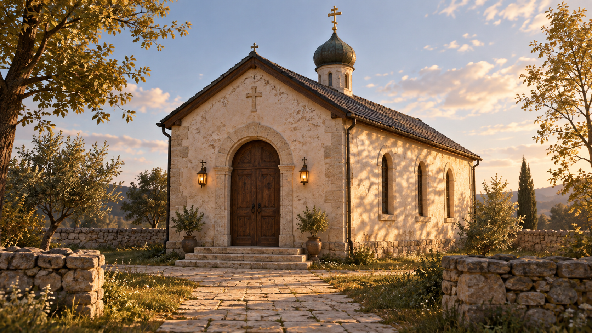
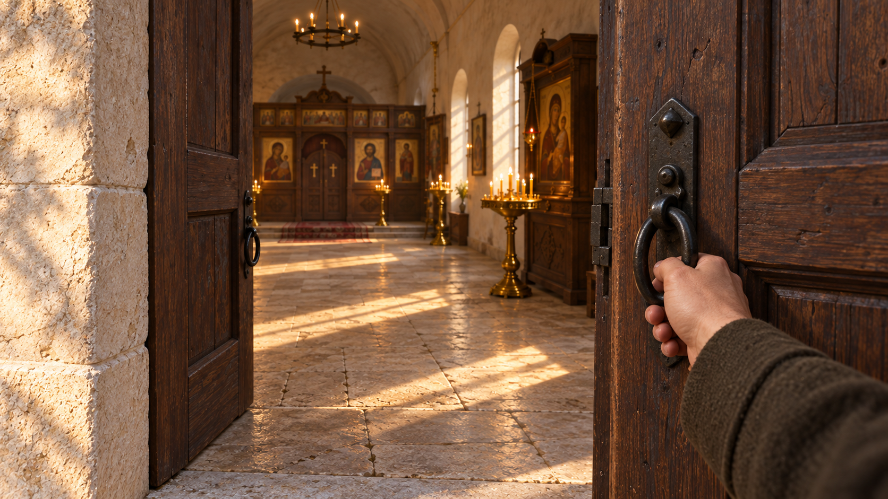
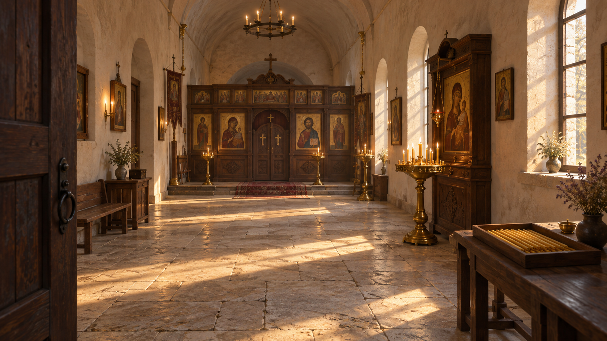
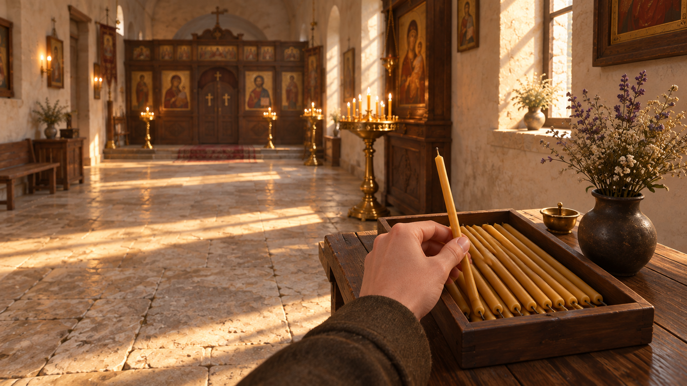
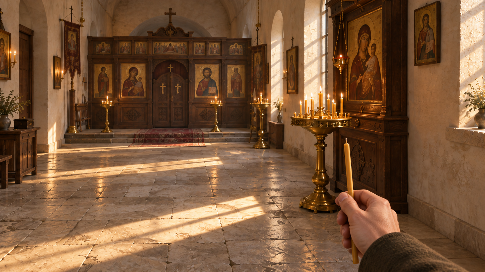
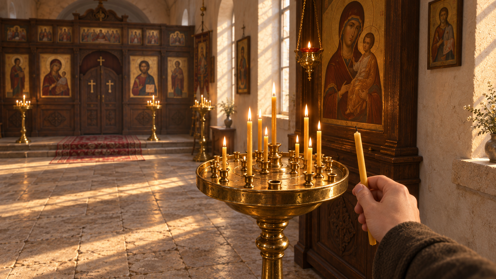
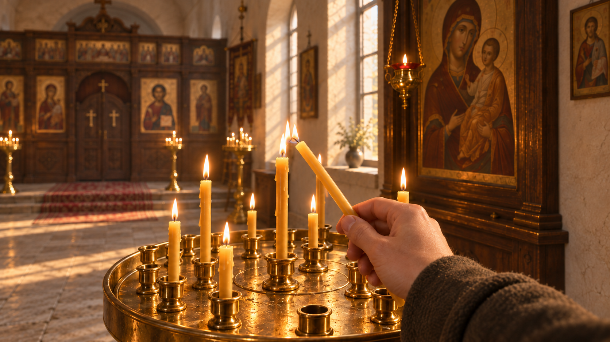
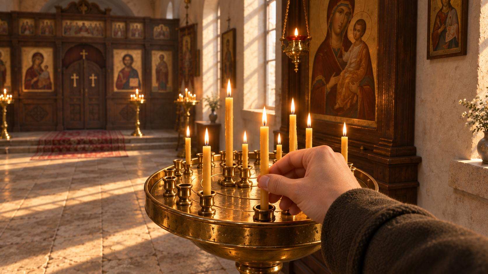
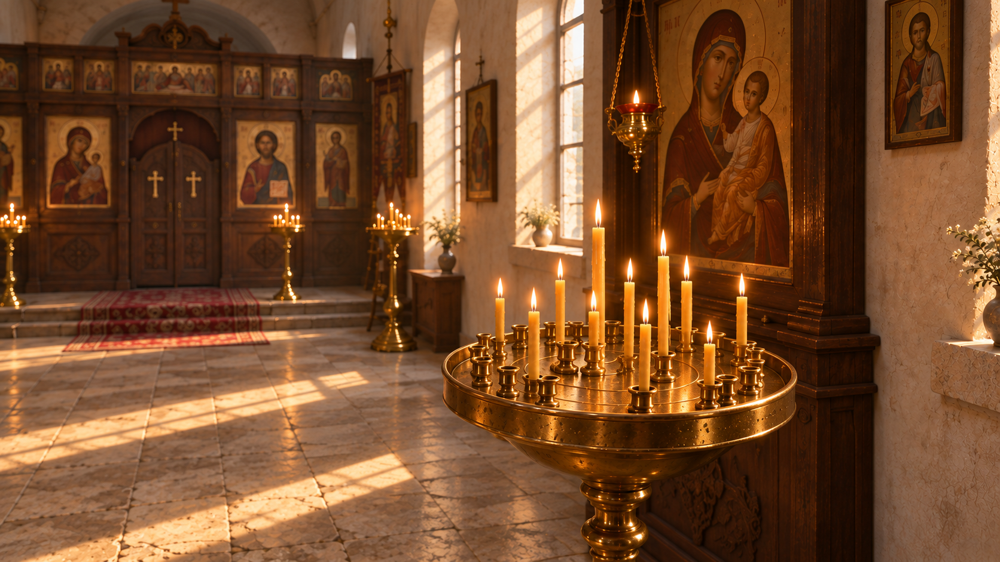

# «Свеча» — девять кадров концепт-арта

Первый визуальный вариант короткой 3D-игры от первого лица. Кадры созданы встроенным **image_gen**; все полные промпты и изображения сохранены в этой папке.

Единая основа: небольшой храм со светлой штукатуркой и низким сводом, тёмный орех, старая латунь, восковые свечи и тёплый послеобеденный свет. **№ 03 — опорный интерьер**, остальные изображения используют кадры этой серии как референсы.

## Содержание

| № | Кадр | Промпт |
| --- | --- | --- |
| 01 | [Подход к храму](#01_church_approach) | [TXT](prompts/01_church_approach.txt) |
| 02 | [Открыть дверь](#02_opening_the_door) | [TXT](prompts/02_opening_the_door.txt) |
| 03 | [Первый взгляд на интерьер](#03_first_interior_view) | [TXT](prompts/03_first_interior_view.txt) |
| 04 | [Взять свечу](#04_taking_a_candle) | [TXT](prompts/04_taking_a_candle.txt) |
| 05 | [Пройти через храм](#05_walking_through_nave) | [TXT](prompts/05_walking_through_nave.txt) |
| 06 | [Перед подсвечником](#06_at_the_candle_stand) | [TXT](prompts/06_at_the_candle_stand.txt) |
| 07 | [Зажечь свечу](#07_lighting_the_candle) | [TXT](prompts/07_lighting_the_candle_v2.txt) |
| 08 | [Поставить свечу](#08_placing_the_candle) | [TXT](prompts/08_placing_the_candle.txt) |
| 09 | [Свеча остаётся гореть](#09_a_moment_of_stillness) | [TXT](prompts/09_a_moment_of_stillness.txt) |

## Как использовать

Кадры задают художественный ориентир и последовательность действий. Это не скриншоты уже работающей игры. Форма отдельных деталей, число фоновых свечей и точные позиции могут различаться: окончательная конструкция и масштаб фиксируются на листе предметов и в 3D-сцене.

Промпты англоязычные, описания на русском. Каждый исходный промпт содержит общую стилистику и задачу конкретного кадра; изображения-референсы перечислены в [MANIFEST.json](MANIFEST.json). Для повторения кадра подать весь текст и перечисленные референсы. Точное повторение пикселей не гарантируется.

Кадр № 07 имеет две версии: исходный [промпт](prompts/07_lighting_the_candle.txt) и [изображение](generated_images/07_lighting_the_candle.png), затем локальная [правка пламени](prompts/07_lighting_the_candle_v2.txt). В галерее используется выбранная исправленная версия.

Сгенерированную иконопись и надписи не переносить в финальные текстуры без подбора конкретных проверенных источников. [Происхождение материалов](../07_PRODUCTION/ASSET_SOURCES_RU.md).

## 01. Подход к храму

Читаемый вход, небольшой объём храма, камень и дерево. Опора для внешней архитектуры.

[Открыть изображение](generated_images/01_church_approach.png) · [Полный промпт](prompts/01_church_approach.txt)

## 02. Открыть дверь

Ручка, толщина створки и переход от улицы к интерьеру. Опора для взаимодействия с дверью.

[Открыть изображение](generated_images/02_opening_the_door.png) · [Полный промпт](prompts/02_opening_the_door.txt)

## 03. Первый взгляд на интерьер

Опорный кадр серии: планировка, свет, столик со свечами справа и подсвечник у иконы.

[Открыть изображение](generated_images/03_first_interior_view.png) · [Полный промпт](prompts/03_first_interior_view.txt)

## 04. Взять свечу

Игрок берёт одну незажжённую свечу. Опора для масштаба предмета и движения руки.

[Открыть изображение](generated_images/04_taking_a_candle.png) · [Полный промпт](prompts/04_taking_a_candle.txt)

## 05. Пройти через храм

Свеча ещё не горит; подсвечник виден впереди. Опора для вида при ходьбе.

[Открыть изображение](generated_images/05_walking_through_nave.png) · [Полный промпт](prompts/05_walking_through_nave.txt)

## 06. Перед подсвечником

Видны существующее пламя и свободное гнездо. Опора для конструкции подсвечника.

[Открыть изображение](generated_images/06_at_the_candle_stand.png) · [Полный промпт](prompts/06_at_the_candle_stand.txt)

## 07. Зажечь свечу

Зажигание от существующего пламени. Отдельная правка уменьшает огонёк у переносимой свечи.

[Открыть изображение](generated_images/07_lighting_the_candle_v2.png) · [Полный промпт](prompts/07_lighting_the_candle_v2.txt)

## 08. Поставить свечу

Зажжённая свеча входит основанием в гнездо. Главный кадр для анимации установки.

[Открыть изображение](generated_images/08_placing_the_candle.png) · [Полный промпт](prompts/08_placing_the_candle.txt)

## 09. Свеча остаётся гореть

Руки больше нет в кадре; установленная свеча продолжает гореть. Опора для завершающего состояния.

[Открыть изображение](generated_images/09_a_moment_of_stillness.png) · [Полный промпт](prompts/09_a_moment_of_stillness.txt)
