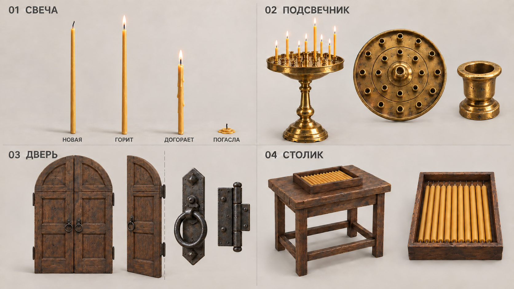

# Листы предметов

Создан первый лист интерактивных объектов для моделирования. Выбран вариант **v3**: к уточнённым свечам и дверной створке добавлен полностью догоревший негорящий остаток. Общий стиль сохранён по концепт-арту: медовый воск, тёмный орех, старая латунь и кованое железо.

[Открыть изображение](generated_images/01_interactive_church_props_v3.png) · [Исходный промпт](prompts/01_interactive_church_props.txt) · [Промпт правки v2](prompts/01_interactive_church_props_v2.txt) · [Промпт полного догорания v3](prompts/01_interactive_church_props_v3.txt) · [Manifest](MANIFEST.json)

## Состав листа

- Тонкая восковая свеча: четыре момента жизни — новая, горящая, догорающая и полностью погасшая с небольшим остатком воска/фитиля.
- Круглый латунный подсвечник: вид целиком, лоток сверху, отдельное гнездо. Сохранить свободное гнездо у ближнего края.
- Деревянная дверь и металлическая ручка: отдельная створка и положение петли.
- Столик и неглубокий лоток со свечами.

## Референсы и варианты

В генерацию переданы кадры [№ 02 — дверь](../02_CONCEPT_ART/generated_images/02_opening_the_door.png), [№ 04 — свеча и столик](../02_CONCEPT_ART/generated_images/04_taking_a_candle.png), [№ 06 — подсвечник](../02_CONCEPT_ART/generated_images/06_at_the_candle_stand.png) и [№ 01 — арка входа](../02_CONCEPT_ART/generated_images/01_church_approach.png). Кадры № 07–08 остаются референсами взаимодействия с предметами.

Изображения созданы встроенным `image_gen`. Для v2 входным изображением служил [исходный лист](generated_images/01_interactive_church_props.png); он сохранён без перезаписи. В v3 входным изображением был [лист v2](generated_images/01_interactive_church_props_v2.png); добавлено окончательное состояние после полного догорания. Полные тексты запросов находятся в `prompts/`, итоговые изображения — в `generated_images/`. В manifest записаны порядок референсов, разрешение, контрольные суммы и результат визуальной проверки.

## Горение в игре

Все горящие свечи, включая окружение, непрерывно укорачиваются по мере расхода воска в реальном масштабе времени 1:1. После полного догорания пламя гаснет, остаются только негорящие воск и фитиль. Четыре изображения на листе — опорные моменты одного процесса, а не набор бесконечных декоративных вариантов.

Пауза пока останавливает симуляцию; закрытая игра не продолжает отсчёт. По решению пользователя новая свеча сгорает за 20 минут (1200 с) активного горения. [ТЗ и проверки](../05_GODOT_PROMPT/MASTER_GAME_PROMPT_RU.md) описывают остаток горючего, изменение высоты, свет и окончательное затухание.

## Как использовать при моделировании

- Лист уточняет силуэты, материалы и раздельные части предметов; сценовые кадры показывают их размещение и игровой ракурс.
- Группы и увеличенные детали показаны в разных масштабах. Не вычислять размеры по пикселям листа. После сопоставления крупных планов: свеча 25 см × 10 мм, подсвечник высотой 1,146 м с лотком Ø 68 см; проход около 1,2 м. Актуальные размеры и посадка приведены из [правил ассетов](../04_BLENDER_ENV/ASSET_PIPELINE_RU.md).
- У отдельной правой створки петли находятся на внешнем правом краю; высокий конец арки — у внутреннего края. Origin модели ставится на ось петель.
- Свеча, подсвечник, створки, ручка и лоток должны оставаться отдельными управляемыми деталями там, где это требуется взаимодействию. Пламя реализуется в Godot отдельно от геометрии свечи. Восковая часть укорачивается сверху; фитиль и огонёк следуют за её верхушкой, а основание остаётся на месте. Для финала нужен отдельный негорящий остаток.
- Точное количество гнёзд и посадку тонкой свечи в них определить в 3D; одно доступное гнездо у ближнего края оставить свободным в начальном состоянии.
- Форма утверждается вместе с проверкой масштаба и взаимодействия в прототипе. Этот лист не заменяет измеренную 3D-модель, UV-развёртку или проверку импорта.

Визуально проверены все четыре группы, комплект видов и деталей, читаемость заголовков и соответствие материалам концептов. По листу создан [первый 3D-набор](../04_BLENDER_ENV/ASSET_PIPELINE_RU.md): свеча, остаток и подсвечник. Также созданы дверь, столик и остальные модели; они включены в проходимый прототип.
