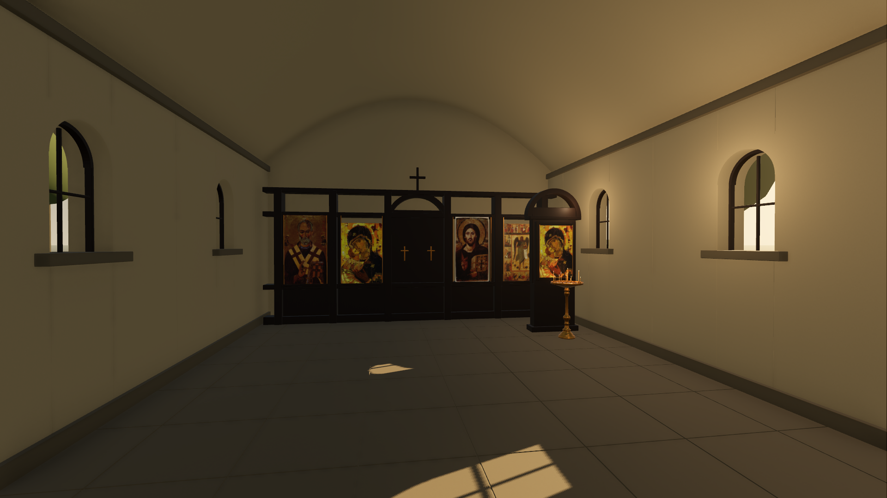

# Ассеты и путь Blender → Godot

**Созданы 13 моделей и проходимый прототип.** Исходники — `art/blender/`, отдельные GLB — `game/assets/models/`, игровые сцены и скрипты — `game/`. Задания и реальные проверочные изображения сохранены в этом разделе.



[Внешний вид](previews/church_outside_godot.png) · [Рука, свеча и подсвечник](previews/church_hand_godot.png) · [Проверки и FPS](../07_PRODUCTION/VALIDATION_RU.md)

## Набор моделей

| Ассет | Blender | GLB | Параметры |
| --- | --- | --- | --- |
| Свеча | [candle.blend](../../art/blender/candle.blend) | [candle.glb](../../game/assets/models/candle.glb) | Воск 250 × 7 мм; 384 треугольника; отдельные Wax, WickAnchor и FlameAnchor |
| Негорящий остаток | [candle_remnant.blend](../../art/blender/candle_remnant.blend) | [candle_remnant.glb](../../game/assets/models/candle_remnant.glb) | Высота 4,5 мм; 424 треугольника; воск и обгоревший фитиль |
| Подсвечник | [candle_stand.blend](../../art/blender/candle_stand.blend) | [candle_stand.glb](../../game/assets/models/candle_stand.glb) | Высота 1 м; лоток Ø 56 см; 19 гнёзд; 20 024 треугольника с экземплярами |
| Дверь с фурнитурой | [church_door.blend](../../art/blender/church_door.blend) | [church_door.glb](../../game/assets/models/church_door.glb) | Рама 1,7 × 2,85 м; две створки с отдельными осями петель; 3156 треугольников |
| Столик | [candle_table.blend](../../art/blender/candle_table.blend) | [candle_table.glb](../../game/assets/models/candle_table.glb) | 0,95 × 0,50 × 0,8525 м; TrayAnchor; 1080 треугольников |
| Лоток | [candle_tray.blend](../../art/blender/candle_tray.blend) | [candle_tray.glb](../../game/assets/models/candle_tray.glb) | Около 0,42 × 0,32 × 0,055 м; свечи отдельными экземплярами; 540 треугольников |
| Оконный модуль | [window_bay.blend](../../art/blender/window_bay.blend) | [window_bay.glb](../../game/assets/models/window_bay.glb) | Ширина 3 м; настоящее арочное отверстие 0,7 м; 1492 треугольника |
| Оболочка храма | [church_shell.blend](../../art/blender/church_shell.blend) | [church_shell.glb](../../game/assets/models/church_shell.glb) | Интерьер около 7 × 11 м; пол, торцы, закрытие свода; 12 648 треугольников |
| Свод | [church_vault.blend](../../art/blender/church_vault.blend) | [church_vault.glb](../../game/assets/models/church_vault.glb) | Подъём 1,7 м, нормали внутрь; 96 треугольников |
| Кровля и глава | [church_roof.blend](../../art/blender/church_roof.blend) | [church_roof.glb](../../game/assets/models/church_roof.glb) | Отдельная кровля без плоского дна; глава и крест; 1926 треугольников |
| Киот | [icon_case.blend](../../art/blender/icon_case.blend) | [icon_case.glb](../../game/assets/models/icon_case.glb) | Высота 2,74 м, изображение Богоматери; 1342 треугольника |
| Иконостас | [iconostasis.blend](../../art/blender/iconostasis.blend) | [iconostasis.glb](../../game/assets/models/iconostasis.glb) | Ширина 6,4 м, закрытые центральные двери, четыре изображения; 5128 треугольников |
| Рука | [hand_grip.blend](../../art/blender/hand_grip.blend) | [hand_grip.glb](../../game/assets/models/hand_grip.glb) | Одна поза, GripAnchor и рукав; 8374 треугольника |

Точные габариты, узлы и материалы: [первый набор](asset_build.json), [остальные модели](church_asset_build.json). Числа — параметры этого прототипа, не стандарты церковных предметов.

`Seat00` — переднее свободное место игрока: `(0, 0.974, 0.228)` м относительно подсвечника в Godot. Точка задаёт дно гнезда. Остальные места — 12 по внешнему кольцу, 6 по внутреннему и одно центральное, включая Seat00. Диаметр отверстия 9 мм соответствует свече 7 мм.

## Материалы и изображения

Пять оригинальных PNG 512 × 512: дерево, штукатурка, известняк, латунь и кровля. Они подключены к Principled BSDF и передаются в GLB. Godot извлекает встроенные изображения рядом с моделями; их `.import` относятся к исходным настройкам, а `.godot/` — кэшу.

Латунь: metallic 0.94 / roughness 0.28. Воск: metallic 0 / roughness 0.42. Поддерживаемые текстуры и параметры PBR проверяются в Godot. Фотографии кожи, сторонние модели и HDRI не использованы. Исторические иконы имеют [отдельные источники и сведения о правах](../07_PRODUCTION/ASSET_SOURCES_RU.md).

## Что выполняет Godot

`church.tscn` и `church.gd` собирают пространство, добавляют коллизии, дверь, столик, точки действий, руку, свет и звук. Двор, дорожка, невысокая ограда и деревья — простая геометрия Godot. Импортированные модели остаются заменяемыми.

`candle.gd` уменьшает высоту воска сверху вниз, сохраняя основание и диаметр. Фитиль, пламя, область зажигания и источник света следуют за верхушкой. Все 11 начальных горящих свечей имеют разный конечный остаток; свеча игрока использует тот же расчёт. При нуле огонь и его свет исчезают, остаётся негорящий остаток.

Масштаб времени 1:1, пауза исключена из монотонного отсчёта. По решению пользователя полный срок новой свечи — 20 минут (1200 с) активного горения. Статичные примеры из листа предметов не заменяют непрерывное горение.

## Запуск и воспроизведение

```sh
./tools/godot --path game
./tools/godot --path game res://scenes/asset_review.tscn
./tools/godot --headless --editor --path game --import
./tools/godot --headless --path game --script res://tests/check_candle_assets.gd
./tools/godot --headless --path game --script res://tests/check_game.gd
```

Вторая команда открывает независимый просмотр: ползунок изменяет геометрию воска, кнопка меняет ракурс. Он сохраняется как удобная проверка масштаба и посадки; игра запускается первой командой.

Пересборка всей геометрии и текстур:

```sh
./tools/blender --background --factory-startup --python-exit-code 1 --python tools/build_church_assets.py
python3 tools/build_audio.py
```

Скрипт перестраивает 13 именованных ассетов и preview. Ручные правки в этих `.blend` необходимо предварительно сохранить отдельно. Текстуры упакованы внутрь `.blend` для переносимости. Blender-студии входят в исходники для просмотра, но исключаются из GLB. Файлы `*_blender.png` — Cycles-render; `*_godot.png` — кадры движка, не image_gen.

## Сохранённые задания

1. [Свеча и остаток](prompts/01_candle_set.md).
2. [Подсвечник](prompts/02_candle_stand.md).
3. [Дверь и фурнитура](prompts/03_door_and_hardware.md).
4. [Столик и лоток](prompts/04_table_and_tray.md).
5. [Архитектура, свод и кровля](prompts/05_church_architecture.md).
6. [Иконостас и киот](prompts/06_iconostasis_and_case.md).
7. [Рука и материалы](prompts/07_hand_and_materials.md).

## Правила дальнейшего экспорта

Метры, unit scale 1.0, корень на опоре, отдельные подвижные части. Экспортировать выбранное дерево ассета в GLB, +Y up, без камер и света. Преобразование осей выполняет glTF-exporter; повторный ручной поворот не нужен. Не применять преобразования, которые уничтожают pivot двери.

После изменения выполнить импорт, проверки и просмотр с высоты глаз. Отсутствие ошибок в headless не подтверждает художественное качество или удобство. Концепт-арт остаётся ориентиром; нынешние модели — первый игровой вариант, пригодный для дальнейшей художественной доработки.
