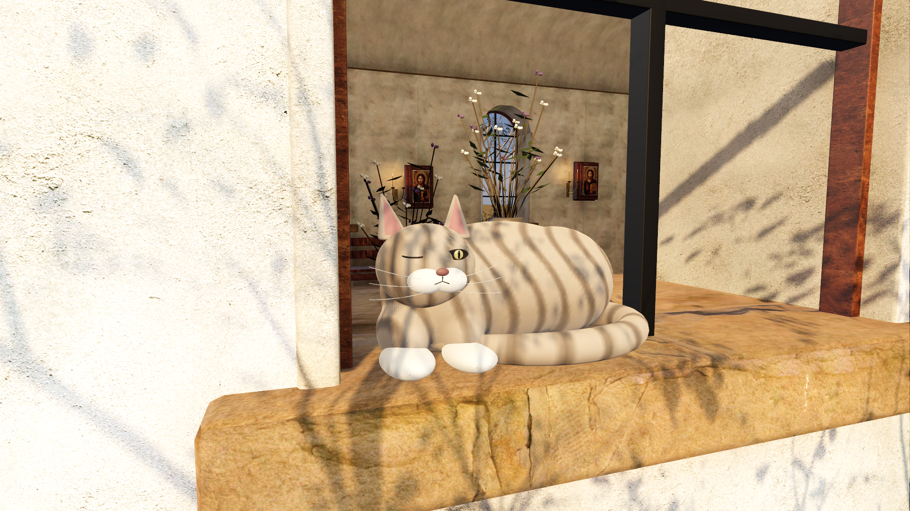

# Кот-смотритель

Пасхалка добавлена 13 сентября 2026 года в локальный проект и macOS-сборку. От входа обойдите храм справа и подойдите к первому окну: на наружном подоконнике спит полосатый кот.

После 1,2 секунды в пределах 1,3 м кот плавно открывает один глаз, смотрит 1,4 секунды и закрывает его. Чтобы повторить реакцию, отойдите дальше 1,8 м после её окончания и вернитесь. Короткий проход и приближение изнутри не будят кота. Пауза останавливает дыхание, ожидание и движение века; повтор эпизода возвращает исходное состояние.

## Игровые кадры

Godot 4.7.2, Forward+ / Metal 4.0, Apple M3; ресурсы пересобранного macOS-приложения. Камера игрока на обычной высоте, подход выполнен настоящим контроллером движения и коллизиями. Это кадры 3D-сцены, а не концепт-арт.

| Спит | Смотрит |
| --- | --- |
|  |  |

[Окно со стороны двора](01_window.png) · [Снова уснул](04_asleep_again.png)

[Видео подхода и реакции, 7 секунд](cat_motion.mp4). Записано штатным Movie Maker Godot при 30 FPS; это воспроизводимая проверка анимации, не замер производительности.

## Реализация и проверка

Исходная модель — `art/blender/sleeping_cat.blend`, GLB — `game/assets/models/sleeping_cat.glb`. [Отчёт геометрии](../cat_build.json). Рисунок шерсти хранится в цветах вершин; материал явно включает их использование в Godot. Корпус, глаз и закрытое веко имеют отдельные узлы. Исходный размер около 50 × 31 × 25 см; в игре масштаб 0,78 под существующую половину оконного проёма.

Логика находится в `game/scripts/sleeping_cat.gd`, игровая сцена — `game/scenes/sleeping_cat.tscn`. Кот получает прямую ссылку на игрока и наследует паузу дерева сцены. Отдельных действий, счётчиков находок и маршрутов NPC нет. Существующий свет интерьера и его геометрия сохранены; кот получает динамический свет.

Проверены импорт, синтаксис GDScript, посадка модели на подоконник, цвета шерсти, ожидание рядом, отсутствие реакции сквозь стену, остановка анимации в паузе, возвращение ко сну, повтор после отхода и сброс нового эпизода. `check_sleeping_cat.gd` проходит на проекте и ресурсах macOS-приложения. `check_game.gd` подтверждает полный маршрут, взаимодействия, конечное горение и повтор. Подпись пересобранного приложения проходит `codesign --verify --deep --strict`.

```sh
./tools/blender --background --factory-startup --python-exit-code 1 --python tools/build_sleeping_cat.py
./tools/godot --headless --editor --path game --import
./tools/godot --headless --path game --script res://scripts/sleeping_cat.gd --check-only
./tools/godot --headless --path game --script res://tests/check_sleeping_cat.gd
./tools/godot --headless --path game --script res://tests/check_game.gd
./tools/godot --path game --script ../tools/record_sleeping_cat.gd
./tools/export_macos.sh
```

`record_sleeping_cat.gd` сохраняет четыре кадра и проверяет подход обычной ходьбой, открытие и закрытие глаза. Для другого каталога добавьте `-- --output-dir /абсолютный/путь`; для записи движения используйте штатный `--write-movie /путь/cat.avi` до `--`.

В нативном журнале остаётся ранее известное предупреждение Metal о семи Texture RIDs при завершении с ReflectionProbe — [ограничение движка](../../../07_PRODUCTION/VALIDATION_RU.md). Ошибок скриптов и загрузки нет. Самостоятельное прохождение и художественная оценка пользователем остаются открытыми. Опубликованная веб-версия не обновлялась.
