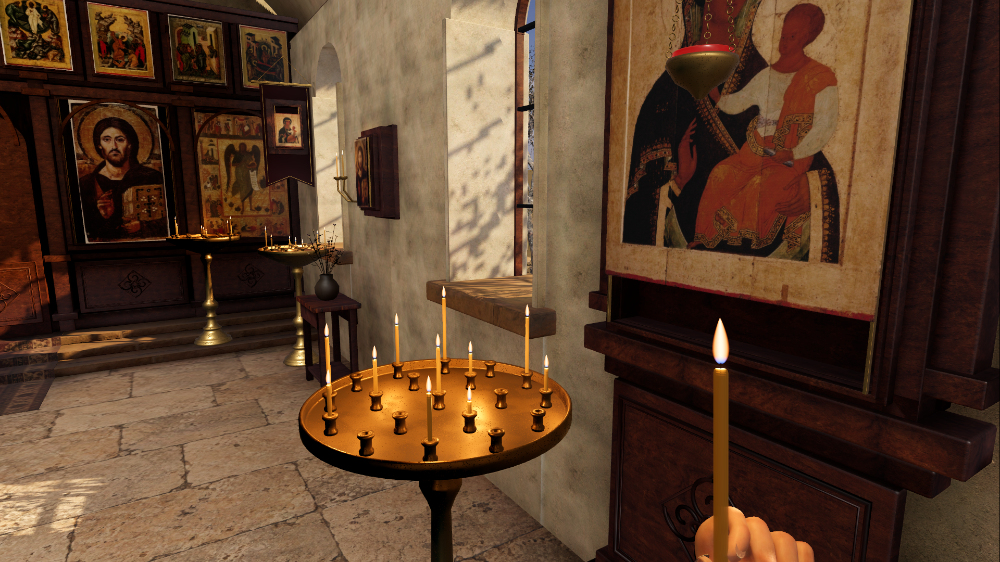
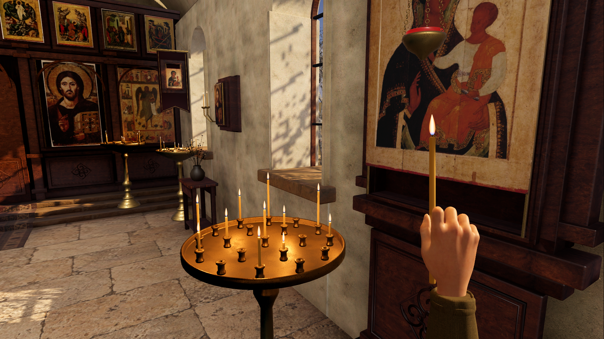

# Исправление руки — 0.2.1

13 сентября 2026. По замечанию пользователя исправлены направление сгиба пальцев, хват свечи и повороты запястья. Раньше пальцы сгибались к тыльной стороне, а добавленные отдельными деталями ногти оказывались на неверной поверхности. Кисть оставалась неподвижной при отпускании предмета.

Теперь суставы используют плоскости исходного скелета MakeHuman; пальцы сгибаются в сторону ладони. Большой и указательный пальцы удерживают свечу диаметром 10 мм. Дополнительные ногти удалены, сохранена исходная текстура. Кисть раскрывается перед взятием, закрывается на предмете и раскрывается после установки. Укорочено скрытое предплечье и исправлен подход к лотку.

## Сравнение

Старая версия 0.2.0:



Новая версия 0.2.1, экспортированный PCK в Godot:



## Движение в игре

- [Взятие свечи — MP4](taking.mp4)
- [Установка и раскрытие пальцев — MP4](placing.mp4)

Это запись настоящей анимации Godot MovieMaker, 1280 × 720, 30 кадров/с. Обрезан прогрев рендера, видео перекодировано в H.264; изображения не дорисовывались. Запись из проекта сделана до упаковки тех же ресурсов в 0.2.1. Автоматическая постановка камеры помогает проверить позы, но не заменяет ручную оценку управления.

## Исходники и проверка

`tools/build_hand.py` сохраняет `art/blender/hand_grip.blend` и `game/assets/models/hand_grip.glb`. В Blender остаются скрытые `HandAuthoringRig` и `HandAuthoringSkin` для изменения поз. В игре используется одна сетка `HandSkin` с морфом `Grip`: 0 — расслабленная кисть, 1 — хват. Между позами работает обычный Tween. Скелет и IK в игровой цикл не добавлены.

Проверены импорт, обе стороны ладони в Blender, пять игровых ракурсов с рукой, запись взятия и установки, полный автоматический маршрут и финальные значения морфа после действий. Срок свечи остался 1200 активных секунд. Проверка окна приложения мышью и клавиатурой отложена из-за заблокированного Mac.

Повторить запись из корня проекта:

```sh
./tools/godot --path game --script ../tools/record_hand_actions.gd \
  --write-movie ../.tools/hand-taking.avi --fixed-fps 30 --disable-vsync -- --shot taking
```

Для установки заменить `taking` на `placing`. Видео с фиксированным шагом не используется для проверки реальной длительности горения.

Основа сетки, веса, скелет и кожа — MakeHuman Team, CC0. Рукав — Poly Haven, CC0. [Источники и лицензии](../../../07_PRODUCTION/ASSET_SOURCES_RU.md).
