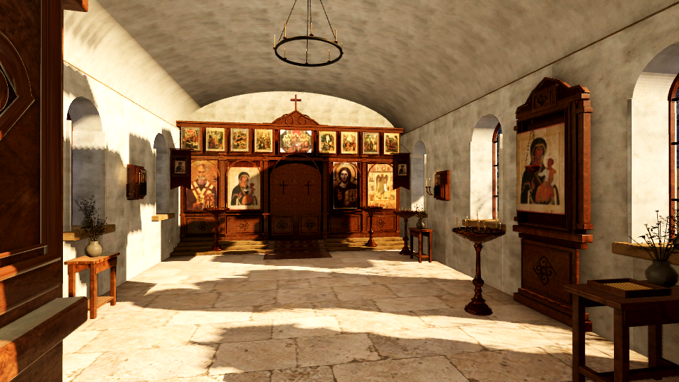
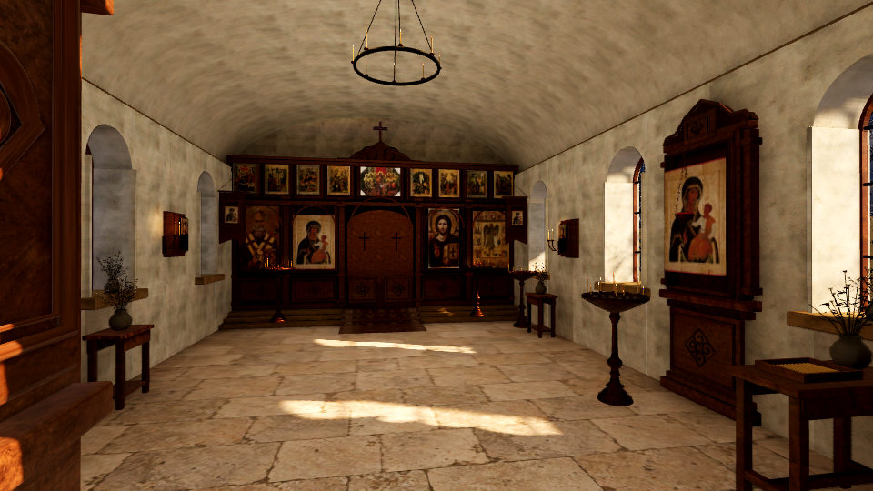
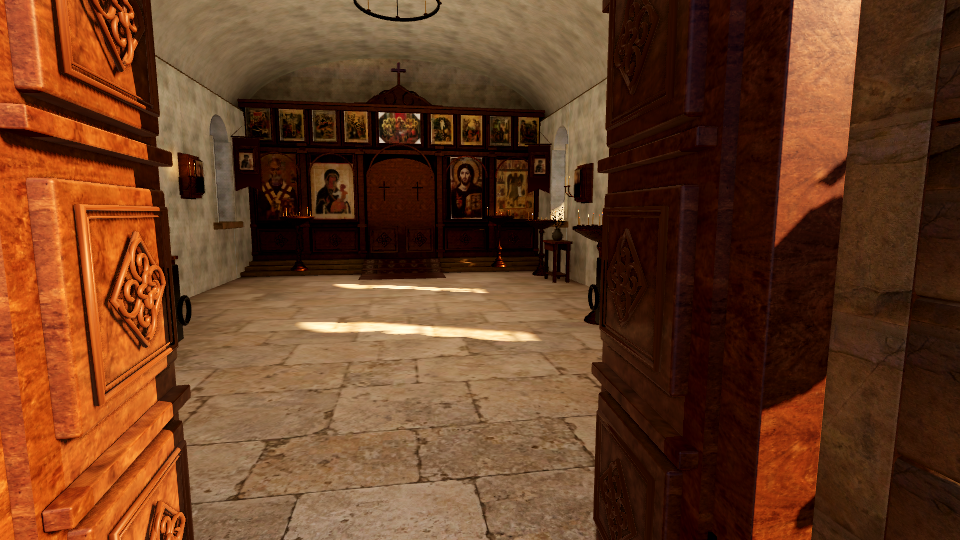

# Стабилизация света Web

13 сентября 2026. Проверено на Godot 4.7.2, Chromium / WebGL 2.0, текущем Mac с Apple M3. Исправление находится в проекте и локальной Web-сборке; GitHub Pages в этой задаче не обновлялся.

## Изображение

Один ракурс, один экспортированный PCK. В варианте «до» проверка отключает новую маску, сохраняя остальные ресурсы и настройки. Маска убирает прямой солнечный свет сквозь крышу и сохраняет оконные пятна.

| Без маски | С маской |
| --- | --- |
|  |  |

## Что изменено

- В существующий LightmapGI добавлена запечённая маска теней архитектуры `nave_shadow.png`. В Compatibility используется Shadowmask Overlay: маска дополняет текущие динамические тени. Forward+ сохраняет прежний режим.
- Солнце остаётся динамическим. Дверь, рука и расходуемые свечи не запекаются как неподвижные предметы; их состояния и горение не изменены.
- Маска сохраняет исходное разрешение при Web-экспорте и хранится без RGTC, неподдерживаемого в проверенном WebGL.
- Для запекания уменьшена область одной GPU-задачи до 128 пикселей. Качество лучей и разрешение не снижены. Повторное запекание завершилось за 2 мин 6 с без ошибок Metal.

Маска покрывает геометрию существующего запекания храма, включая фасад и входные ступени. Дальний двор, деревья и грунт сохраняют динамические тени.

## Проверка

`tools/check_lighting.gd` проверяет реальные текстуры маски и привязки мешей, отсутствие двери в запекании и динамический режим солнца. Затем он намеренно ограничивает дальность динамических теней до 0,5 м: защищённые крышей участки штукатурки должны сохранять освещение. Дополнительно проверяется наличие солнечной полосы на полу — простое выключение солнца тест не проходит.

В WebGL вариант без маски проваливает обе проверки засветки; исправленный вариант проходит. Изменение нормированной яркости защищённых участков при исчезновении динамических теней — 0; вклад прямого солнца в затенённых участках не превышает 0,007 при допуске 0,04. Оконный свет остаётся видимым. Это сравнение пикселей, не измерение освещённости в люксах.

Дверь открыта настоящим игровым действием, сняты оба состояния и проход от входа в интерьер. Проверены изображения; это автоматическая проверка камеры и взаимодействия, не самостоятельное прохождение человеком с мышью. Изменение тени двери на полу при текущем угле солнца отдельно не подтверждено; проверены её динамический режим и исключение из запекания.



[Закрытая дверь](door_closed.png) · [Подход к входу](route_8.0.png) · [Внутри](route_4.0.png)

`GAME_CHECK`, `CANDLE_ASSET_CHECK` и `SLEEPING_CAT_CHECK` проходят. Импорт и экспорт завершились без ошибок. В финальном браузерном прогоне нет ошибок JavaScript и сообщений уровня error в консоли. Два первоначальных запуска запекания с тайм-аутом Metal и ранние варианты тестового запуска не приняты как доказательство готовности.

## Производительность

Один парный замер при **1600×900**, 260 кадров на одинаковом маршруте камеры, без записи видео и параллельной работы GPU. Проверочные изображения сняты отдельно при 960×540. VSync не отключён; числа характеризуют этот запуск на этом Mac, а не все браузеры и видеокарты.

| Показатель | Без маски | С маской |
| --- | ---: | ---: |
| Медианное время кадра | 36,4 мс | 38,5 мс |
| 95-й перцентиль | 56,1 мс | 58,8 мс |
| Эквивалент FPS по медиане | 27,5 | 26,0 |

Дополнительное медианное время кадра — около **5,8%**. Общая производительность Web при этом разрешении остаётся ограниченной; эта правка стабилизирует тени, но не оптимизирует геометрию всей сцены.

[Исходный отчёт без маски](baseline_report.json) · [Отчёт с маской](fixed_report.json)

## Воспроизведение

Из корня проекта:

```sh
./tools/export_web.sh
python3 tools/check_web_lighting.py
# Контрольный прогон должен завершиться с FAIL / кодом 1:
python3 tools/check_web_lighting.py --baseline

# Та же проверка в локальном Compatibility с изображением:
./tools/godot --path game --rendering-method gl_compatibility \
  --script ../tools/check_lighting.gd -- --output /tmp/svecha-lighting
```

Браузерный runner использует отдельную временную страницу и штатный `override.cfg`; игровой PCK не изменяется. Кадры, результаты и журналы сохраняются в `.tools/checks/web-lighting/`. Нужны Python 3, `agent-browser` и установленный браузер. В конце тестовое окно и HTTP-сервер закрываются.
