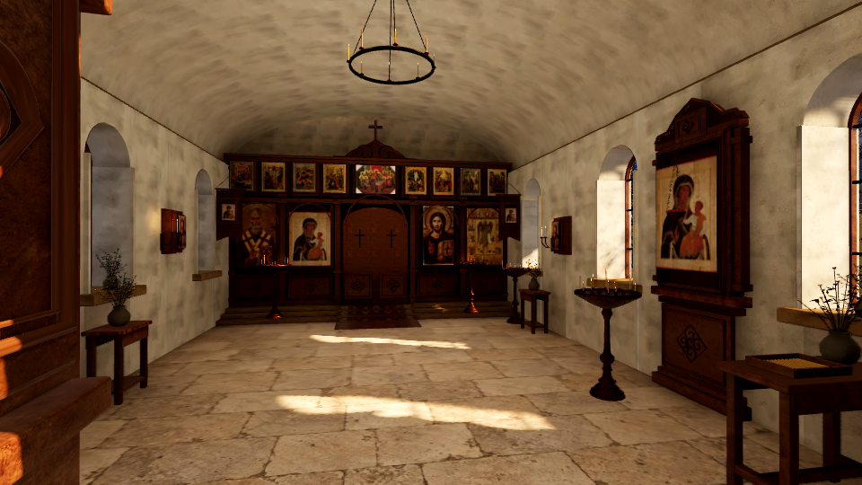
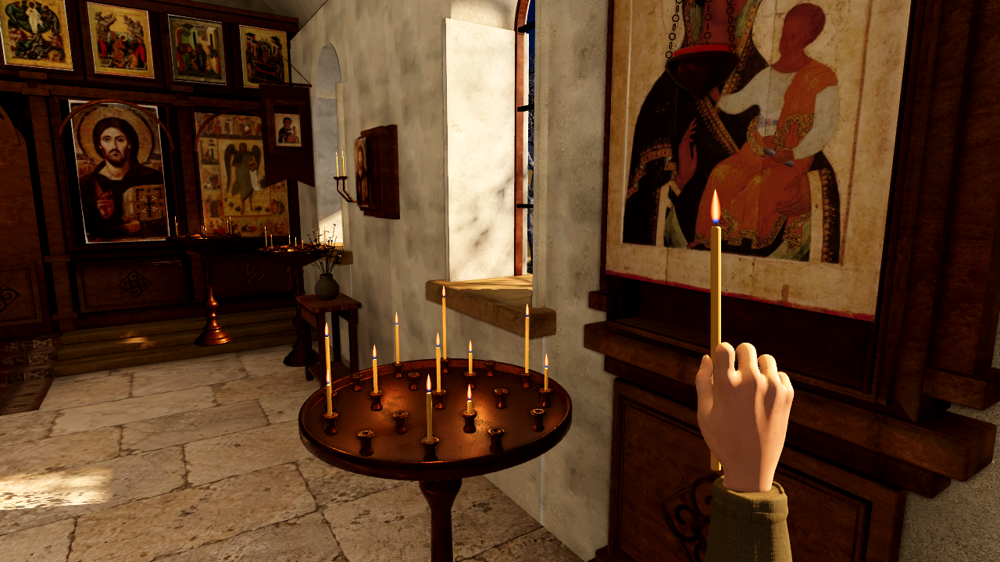
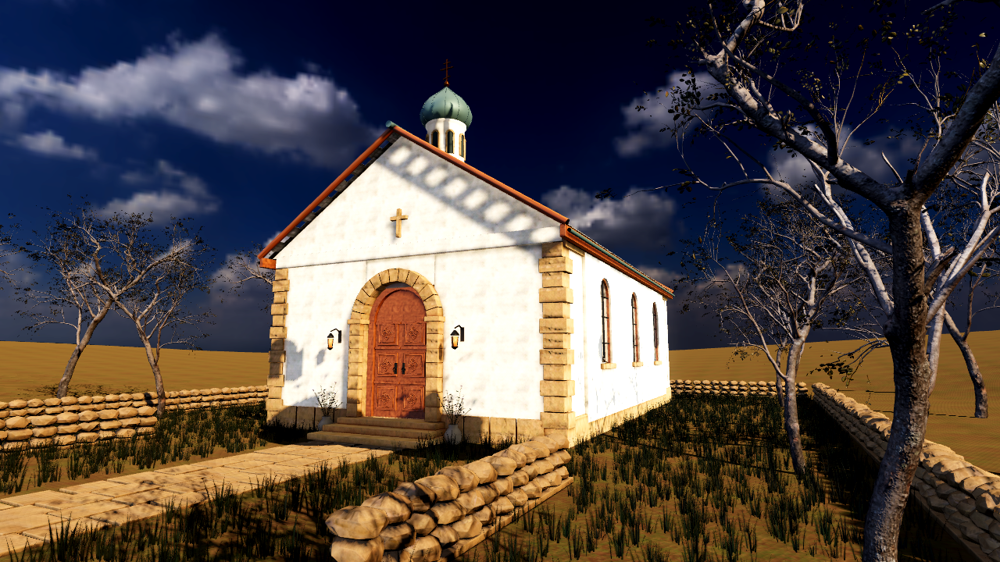
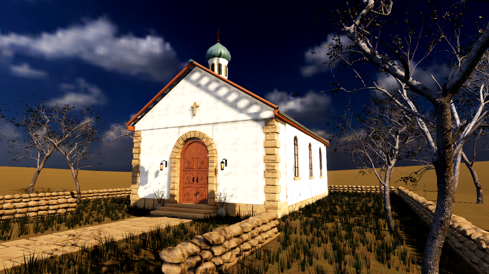

# Уменьшение Web-сборки

13 сентября 2026. Оптимизация выполнена в локальной сборке Godot 4.7.2. GitHub Pages пока не обновлён.

## Результат

| Показатель | До | После |
| --- | ---: | ---: |
| PCK без HTTP-сжатия | 186,04 МиБ | 59,69 МиБ |
| Все файлы Web после gzip, уровень 6 | 164,95 МиБ | 49,92 МиБ |
| Запуск до меню через localhost, один холодный запуск | 3,95 с | 2,86 с |
| Теоретическая передача при 20 Мбит/с, без запуска движка | 69 с | 21 с |

Объём передачи уменьшен на **69,7%**, примерно в **3,3 раза**. Бюджет 50 МиБ достигнут. Здесь сравниваются две локальные сборки с одинаковыми котом и исправлением теней; опубликованная сборка из первоначального аудита немного меньше исходной локальной. Повторная сборка с чистого импорта подтвердила размер 49,92 МиБ.

Размеры измерены одинаковым gzip на всех файлах, включая небольшие файлы титров. Браузерный Resource Timing подтвердил передачу PCK с gzip: 162 715 266 → 42 086 582 байт. Использованы свежие сессии Chromium, localhost с gzip и `Cache-Control: no-store`. Отсчёт — от навигации до штатного скрытия загрузочного экрана Godot. Это один парный замер на текущем Mac, без ограничения скорости сети; он не предсказывает точное время запуска на другом устройстве или GitHub Pages.

[Размеры до](before_sizes.json) · [Размеры после](after_sizes.json) · [Чистая сборка](clean_sizes.json) · [Браузер до](loading_before.json) · [Браузер после](loading_after.json)

## Реализация

- `tools/prepare_web.py` применяет профиль только в `.tools/web-project/`: 512 пикселей для фоновых текстур, 1024 для икон и текстуры кожи руки. Цвет и шероховатость используют Lossy WebP с качеством 0,8; normal maps сохраняют VRAM-сжатие. Одинаковые исходные изображения и их копии в GLB получают одинаковые mipmaps.
- `tools/compact_web.py` сохраняет все пути и байты ресурсов, но помещает одинаковые данные в PCK один раз. После облегчения текстур это убирает ещё 13,05 МиБ из PCK. Несколько путей указывают на один участок данных. Это устранение дубликатов передачи, а не объединение объектов текстур в памяти GPU.
- Упаковщик проверяет MD5 каждого исходного файла и равенство всех путей и содержимого после операции. Неизвестный формат PCK или загрузочной страницы останавливает обработку. Размер в HTML обновляется вместе с PCK для правильного индикатора загрузки.
- Экспорт сохраняет JSON-отчёт и останавливает сборку при превышении 50 МиБ с gzip. GitHub Actions запускает тесты упаковки и полный игровой маршрут на конечном PCK.

Геометрия, игровой код, длительность горения, исходники для macOS, карта света и разрешение маски теней не менялись. Более агрессивная стилизация, другой движок, Basis Universal и собственный шаблон WASM для достигнутого результата не потребовались.

## Изображение

Интерьер снят в WebGL при 960×540. Рука и двор — из экспортированных PCK в нативном Compatibility при 1280×720. Это соответствующие парные ракурсы, но разные способы запуска; нативные кадры не подменяют проверку WebGL. Пламя и трава могут немного различаться из-за анимации.

| Ракурс | До | После |
| --- | --- | --- |
| Интерьер, WebGL |  |  |
| Рука и свеча, Compatibility |  |  |
| Двор, Compatibility |  |  |

На проверенных кадрах сохранены форма предметов, расположение света и читаемость икон. Фактура штукатурки и некоторых фоновых поверхностей стала мягче. Художественное принятие остаётся за пользователем.

## Проверка и ограничения

- Пять тестов Python проверяют сохранение путей и байтов, повторную упаковку, отказ на повреждённом/неподдерживаемом PCK, согласованность с HTML и сохранение важных настроек текстур и маски теней.
- `GAME_CHECK`, `CANDLE_ASSET_CHECK`, `SLEEPING_CAT_CHECK` проходят на экспортированном PCK. Проверены игровые ограничения и маршрут с коллизиями; это автоматическое прохождение.
- Браузер загрузил итоговую игру без ошибок JavaScript и сообщений уровня error. [Проверка света](lighting_after.json) проходит: исчезновение динамических теней не засвечивает защищённые участки, оконный свет сохраняется, дверь открывается игровым действием.
- В нативном Compatibility остались прежние предупреждения о преобразовании BPTC и недоступных эффектах кожи; они присутствуют в обоих вариантах. В проверенном Chromium таких ошибок нет.
- Самостоятельное прохождение человеком, художественное принятие и скорость на внешнем соединении после публикации не проверены. Сервер может использовать другой уровень gzip; 49,92 МиБ — воспроизводимая локальная метрика, не обещание точного Content-Length GitHub Pages.

Из корня репозитория:

```sh
python3 tools/test_web_export.py
./tools/export_web.sh
./tools/godot --headless --path .tools/web-project \
  --main-pack "$PWD/builds/web/index.pck" \
  --script "$PWD/game/tests/check_game.gd"
python3 tools/check_web_lighting.py
```

Отчёт размера — `.tools/checks/web-size.json`. Рабочие журналы и парные кадры текущей проверки — `.tools/checks/web-size/`.
